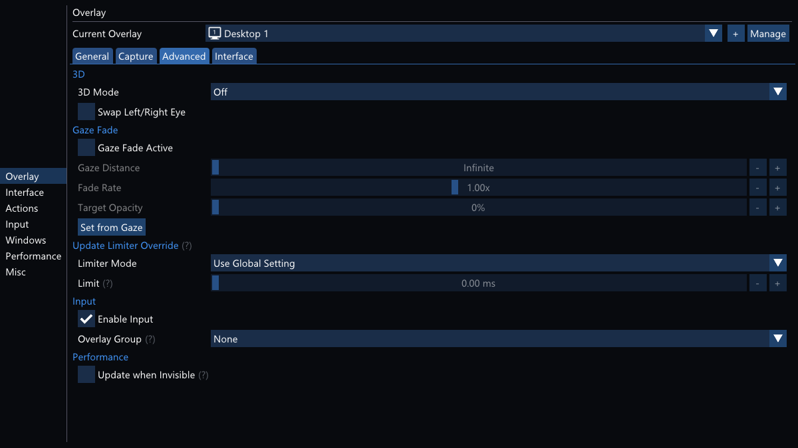
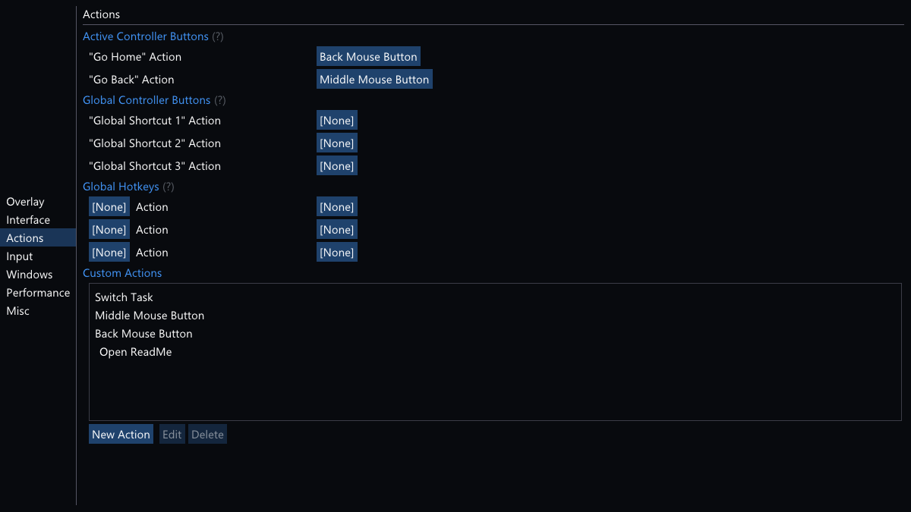
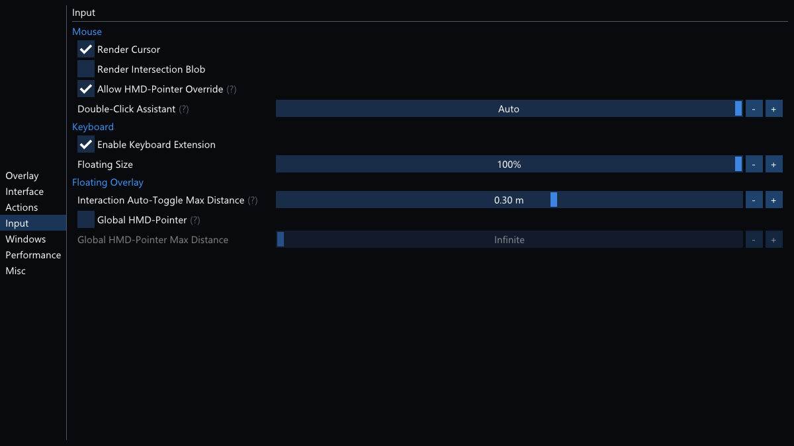
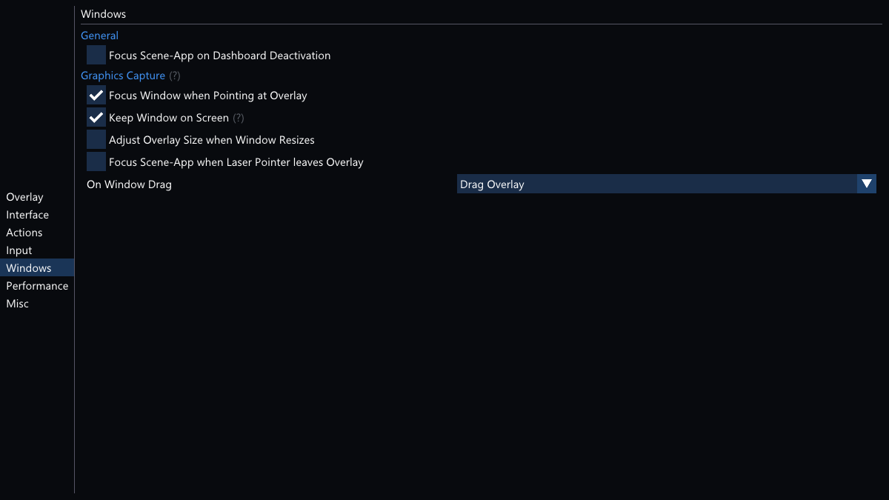
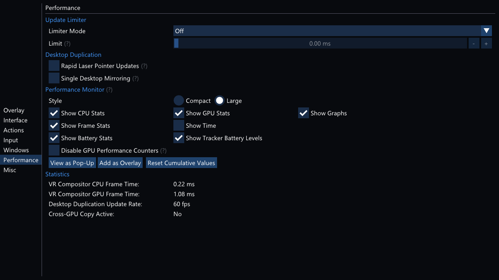
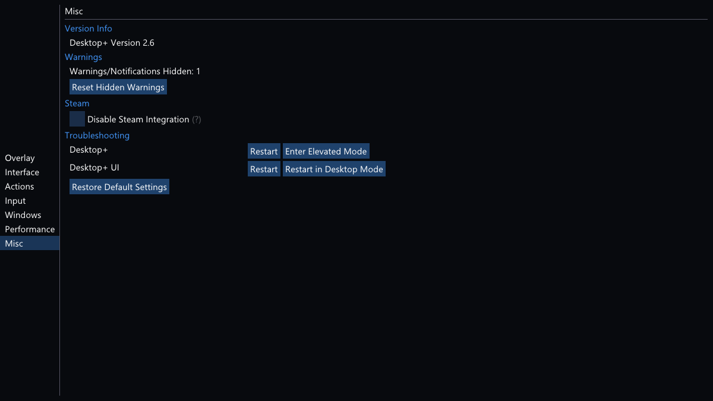
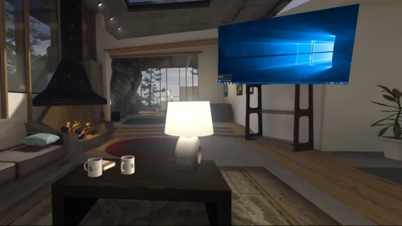
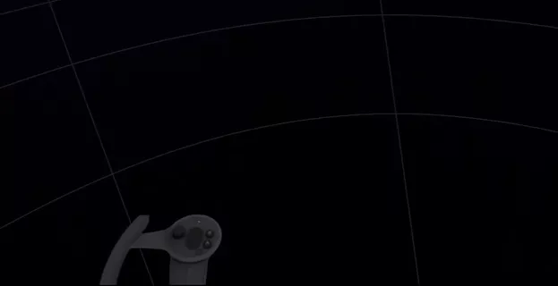
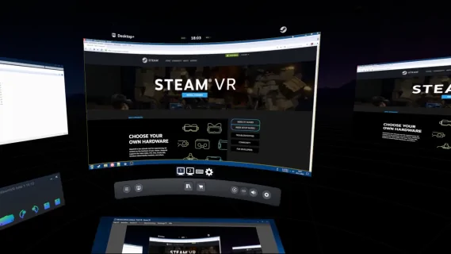

# Desktop+ User Guide

This document explains the options in Desktop+ and possible usage scenarios in greater detail. It is generally not required to be read in order to get started with Desktop+, but can serve as a reference if one does get stuck.  
This guide does not touch upon all topics covered by the [readme file](../assets/readme.txt). It's recommended to read it beforehand.

## Contents

* [Interface](#interface)
  * [Floating UI](#floating-ui)
  * [Settings Window](#settings-window)
    * [Overlay](#overlay)
      * [General](#general)
      * [Capture](#capture)
      * [Advanced](#advanced)
      * [Interface](#interface-1)
    * [Interface](#interface-2)
    * [Actions](#actions)
    * [Input](#input)
    * [Windows](#windows)
    * [Performance](#performance)
    * [Misc](#misc)

* [Performance Considerations](#performance-considerations)
  * [Desktop Duplication](#desktop-duplication)
  * [Graphics Capture](#graphics-capture)
  
* [Desktop Duplication vs. Graphics Capture](#desktop-duplication-vs-graphics-capture)
  * [Desktop Duplication](#desktop-duplication-1)
    * [Mirroring at Unconstrained Frame-Rates](#mirroring-at-unconstrained-frame-rates)
  * [Graphics Capture](#graphics-capture)
    * [Graphics Capture Feature Support](#graphics-capture-feature-support)
    
* [Usage Examples](#usage-examples)

## Interface

### Floating UI

An interface fading in when hovering an overlay, consisting of a vertical bar with quick access to disabling the overlay, toggling drag mode and showing an additional horizontal Action Bar with customizable buttons.  
The dashboard overlay has an always-visible variant of that horizontal bar centered below it. It additionally features a settings button on the right end, allowing to access the settings window from within VR.

### Settings Window

#### Overlay

Configures the state of the current overlay. Changes made here do not apply to other overlays.

- **Current Overlay**
  - **(Drop-down List)**:  
  Use the drop-down list to select which overlay's settings to show. The drop-down list can be right-clicked to rename the current overlay. Hovering a selection highlights the overlay in the VR space to help you identify it.  
  Overlay names are generated automatically based on the overlay's capture settings unless they were renamed manually. To restore the automatic overlay name, leave the input field blank when renaming.
  - **[+]**:  
  Click to quickly add another overlay.
  - **[Manage]**:  
  Click to open the overlay management pop-up. Overlays can be added, renamed, removed, sorted or set as current from there. Added overlays copy the settings from the current overlay and are positioned next to it if possible. You can also click on the overlays in the VR space to select them while the pop-up is open.

##### General

- **Profiles**
  - **Type**:  
  Changes what kind of profile is loaded or saved. Single-Overlay profiles will only store and override the current overlay, while Multi-Overlay profiles will store all overlays when saved and replace all overlays when loaded.
  - **Profile**:  
  Click on the drop-down list to select a profile. If you want to create a new profile, choose "[New Profile]". The default profile can be loaded to quickly reset the current or all overlays to the initial state. Profile lists between types are separate.
  - **[Load]**:  
  Load the selected profile. This will override the current overlay settings or even all overlays in case of Multi-Overlay profiles.
  - **[Add]**:  
  Only available for Multi-Overlay profiles. Adds the overlays from the profile to the overlay list, without overriding anything.
  - **[Save]**:  
  Saves the selected profile. If you selected "[New Profile]", you will be prompted to enter a profile name.
  - **[Delete]**:  
  Deletes the selected profile. The button will change label to prompt for confirmation. Press it another time to really delete the profile.
  
- **Appearance**
  - **Enabled**:  
  Changes the enabled state of the overlay. A disabled overlay will be inactive and not visible, regardless of any other setting. 
  - **Width**:  
  Width of the overlay. The height is automatically determined by the aspect ratio of the mirrored content.
  - **Curvature**:  
  Sets how much the overlay curves inwards.
  - **Opacity**:  
  Sets how translucent the overlay appears. 100% is fully visible.
  
- **Position** (Dashboard Overlay)
  - **Offsets**:  
  Offsets from the default position within the dashboard.
  
- **Position** (Other Overlays)
  - **Display Mode**:  
  Click on the drop-down list to select a display mode. Display modes restricts under which condition the overlay is visible. For example, "Only in Scene" only shows the overlay while a scene application/game is active and hides it while the dashboard is visible.
  - **Position Origin**:  
  Click on the drop-down list to select the position origin of the overlay. This can be used to attach an overlay to controllers or the HMD.
  - **Position**:
    - **[Change]**:  
    Opens the overlay position change pop-up and activates overlay drag-mode. You can use the buttons to do manual position adjustments or simply drag the overlay in the VR space to reposition them. Using right-click to drag triggers a gesture drag, allowing you to rotate and scale overlays based on the motions of both hand-controllers.
    - **[Reset]**:  
    Reset the position of the overlay. Depending on the origin the new position will be near the zero point of it or next to the dashboard overlay.
    
##### Capture

- **Capture Settings**
  - **Capture Method**:  
  Changes the capture API used for this overlay. Graphics Capture additionally allows capturing windows directly. See [Desktop Duplication vs. Graphics Capture](#desktop-duplication-vs-graphics-capture) for a detailed comparison of both APIs.
  - **Source** (Graphics Capture):  
  Click on the drop-down list to select the capture source for the overlay. The list contains available capturable desktops and windows.
    - **[Use Active Window]**:  
    Select the current foreground window as the capture source.
    - **[Use Picker Window]**:  
    Use the Graphics Capture picker window to select the capture source. This is a fallback option and not present when using Windows 10 version 2004 or newer.
    
- **Desktop Cropping** (Desktop Duplication)
    - **Desktop**:  
    Click on the drop-down list to select a desktop to crop the combined desktop mirror to. This selection is also used when resetting the cropping rectangle.
    - **[Crop to Desktop]**:  
    Change the cropping rectangle to match the selected desktop.

- **Cropping Rectangle**  
Rectangle the overlay content is cropped to. If the cropping rectangle is larger than the overlay content, it's clamped to the maximum possible area.  
Cropping rectangles are preserved when switching between capture sources. This can lead to an invalid rectangle being set for the new capture source, making the overlay essentially invisible as a result.  
In that case, a "(!)" warning is displayed next to this section's title and it's recommended to simply use the *[Reset]* button to fix it.
  - **X/Y/Width/Height**:  
  Position and size of the cropping rectangle. Width and height can be set to "Max" by dragging the slider into the right-most position. The cropping rectangle will always assume the maximum possible size in that case.
  - **[Reset]**:  
  Reset the cropping rectangle to default values. If a desktop to crop to is set, it will restore the values for that. Otherwise, it resets to maximum possible rectangle.
  - **[Crop to Active Window]** (Desktop Duplication):  
  Change the cropping rectangle to match the foreground window.

##### Advanced

- **3D**
  - **3D Mode**:  
  Changes the way the overlay's image is split up between both eyes to create a 3D image.
  - **Swap Left/Right Eye**:  
  Swaps which eye gets each split up part of the overlay image.

- **Gaze Fade** (Other Overlays)  
Gaze Fade gradually fades the overlay to the target opacity when not looking at it. When the overlay is at 0% opacity it is considered inactive and will not react to laser pointer input.
  - **Gaze Fade Active**:  
  Activates Gaze Fade for the overlay.
  - **Gaze Distance**:  
  Distance of the gaze point from the HMD. Put the slider to the leftmost value to set it to "Infinite".
  - **Fade Rate**:  
  Rate at which the fading occurs. As Gaze Fade only takes the center point of the overlay in account, adjusting this value depending on the overlay size is recommended.
  - **Target Opacity**:  
  Opacity to fade towards. If this is set higher than the overlay's opacity, it inverts the Gaze Fade behavior (fading in when looking away).
  - **[Set from Gaze]**:  
  Configure Gaze Distance and Fade Rate values automatically from the current gaze and overlay settings. After clicking, a pop-up will appear asking to look at the overlay for 3 seconds.

- **Update Limiter Override**
  - **Limiter Mode**:  
  Sets the limiter mode for this overlay only. Overrides the global setting.
  - **Limit**:  
  Sets the limit in either ms or frames per second. Due to the shared textures between overlays, the limit resulting in the most updates among all active overlays of the same capture source is used.
  
- **Input**
  - **Enable Input**:  
  Allows input on the overlay. When this is off, the overlay will not react to any laser pointer activity or button inputs. Its Floating UI will also be unavailable.
  - **Overlay Group**:  
  Sets the group the overlay belongs to. Overlay groups are used to target overlays in actions and input bindings.  
  This is currently only used to change the enablement state of multiple overlays at once.
    
- **Performance**
  - **Update when Invisible**:  
  Updates the overlay even when invisible from Opacity setting or Gaze Fade.  
  This helps with third-party applications accessing the overlay's contents but is not recommended otherwise. Updates are still suspended if the overlay is disabled or hidden by Display Mode setting.  
  Allowing overlays to update when not needed can have a significant performance impact.
  
##### Interface

- **Floating UI**
  - **Show Floating UI**:  
  Fades in the Floating UI when pointing at the overlay. This cannot be turned off for the dashboard overlay.
  - **Show Desktop Buttons**:  
  Adds buttons for quickly switching desktops to the horizontal Action Bar of the Floating UI.
  
- **Action Buttons**
  - **Use Global Setting**:  
  When active, the overlay-specific Action Bar button order shown below it isn't used.
  - **(Action Button List)**:  
  Overlay-specific order and visibility of action buttons can be customized here. This list can be expanded by creating custom actions.
  
#### Interface

- **Settings Interface**
  - **Display Scale**:  
  Changes the size of text and widgets in the settings interface. Floating UI is unaffected. Does not apply in desktop mode.
  
- **Desktop Buttons**
  - **Listing Style**:  
  Changes the way the desktops are listed on the Action Bar or if at all.
  - **Add Combined Desktop**:  
  Adds a button for the combined desktop to the Action Bar.

- **Action Buttons**
  - **(Action Button List)**:  
  Global order and visibility of action buttons on the Action Bar can be customized here. This list can be expanded by creating custom actions.
  
- **Interface**
  - **Background Color**:  
  Allows to partially or fully cover the VR scene either only while looking at the Desktop+ dashboard tab or at all times.  
  Click on the color button to open the color picker pop-up and click on the drop-down list to choose when the background color appears.
  - **Dim Interface**:  
  Dims the SteamVR dashboard and Desktop+ UI while the Desktop+ dashboard tab is open.

#### Actions

- **Active Controller Buttons**  
Controller bindings when pointing at a Desktop+ overlay. The actual buttons used for these are defined in the VR Compositor SteamVR input bindings. These bindings do not support being held down, meaning a "Press Keys" action is pressed and released instantly unless "Toggle Keys" is active for said action.
  - **"Go Home/Back" Action**:  
  Action triggered when pressing the "Go Home" or "Go Back" button. This is typically one of the face buttons on the controller by default. Click the button to change the action.
  
- **Global Controller Buttons**  
Controller bindings when the dashboard is closed and not pointing at any overlay. The buttons used for these are defined in the Desktop+ SteamVR input bindings. These bindings will trigger globally, but not block other VR applications inputs.
  - **"Global Shortcut 1/2/3" Action**:  
  Action triggered when pressing the respective bound button. These inputs are not bound to anything by default. Click the button to change the action.
  
- **Global Hotkeys**:  
System-wide keyboard shortcuts. Hotkeys block other applications from receiving that input and may not work if the same combination has already been registered elsewhere.  
Desktop+ will not register a hotkey if no action is assigned to it. Most hotkeys without modifiers will not work while elevated applications have focus.
  - **[(Keyboard Shortcut)] Action**:  
  Action triggered when pressing the respective keyboard shortcut. Click on the left button to change the keyboard shortcut for the hotkey.

  
- **Custom Actions**  
Custom actions are user-definable actions which can be bound to controller buttons, the Action Bar or just executed directly from the list. These Actions can press keys, type strings, launch applications or toggle an overlay's enabled state.  
Custom icons for these actions can be added by putting PNG files in the "images/icons" folder. Recommended size is 96x96 pixels.
  - **(Custom Action List)**:  
  Lists currently configured custom actions. The buttons below the list can be used to manage them.
  
#### Input

  
- **Mouse**
  - **Render Cursor**:  
  Sets if the cursor is rendered on top of the mirrored overlay. Graphics Capture overlays hide the cursor automatically when the source window is not in focus.
  - **Render Intersection Blob**:  
  Sets if the SteamVR overlay intersection blob is shown when pointing at a Desktop+ overlay.
  - **Allow HMD-Pointer Override**:  
  Disables the laser pointer when the physical mouse is moved rapidly after the dashboard was opened with the HMD button. Re-open or click the overlay to get the laser pointer back.  
  This option is primarily useful when sitting in front of the desk using the real mouse and keyboard while wearing the headset to view the desktop.
  - **Double-Click Assistant**:  
  Freezes the mouse cursor for the set duration to ease the input of double-clicks. The "Auto" setting uses the double-click duration configured in Windows.  
  Moving larger distances from the frozen cursor position cancels the Double-Click Assistant.
  
- **Keyboard**
  - **Enable Keyboard Extension**:  
  Adds additional keyboard modifier toggles, tab, function and arrow keys below the SteamVR keyboard when used with Desktop+ overlays. Note that the modifier toggles directly manipulate the global keyboard state, so using them and the hardware keyboard at the same time may conflict.
  - **Floating Size**:  
  Size of the SteamVR keyboard when used for non-dashboard/floating Desktop+ overlays.
  
- **Floating Overlay**
  - **Interaction Auto-Toggle Max Distance**:  
  Maximum allowed distance between overlay and pointing controller to automatically toggle interaction mode while the dashboard is closed. Set this to "Off" when using the global controller binding toggle.
  - **Global HMD-Pointer**:  
  Enables using HMD gaze to point at Desktop+ overlays while the dashboard is closed.  
  This option only allows to move the mouse cursor with the HMD gaze, no other inputs. It is mainly useful to change focus, get the cursor to window overlays and then use the physical mouse to continue the interaction.
  - **Global HMD-Pointer Max Distance**:  
  Maximum allowed distance between overlay and HMD when Global HMD-Pointer is enabled. Put the slider to the leftmost value to set it to "Infinite".
  
#### Windows

- **General**
  - **Focus Scene-App on Dashboard Deactivation**:  
  Tries to change the foreground window to the current VR scene-app (current application/game) after the dashboard was closed. Some games may pause or decide to not process inputs when not being in focus on the desktop. Note that some scene applications such as SteamVR Home do not have a desktop window at all.
  
- **Graphics Capture**  
These settings only apply to Graphics Capture overlays with a source window.
  - **Focus Window when Pointing at Overlay**:  
  Tries to change the foreground window to the mirrored window when pointing at the overlay. This generally recommended to be left enabled in order to prevent unintended inputs on other windows.  
  Note that always-on-top windows will still be in front of the mirrored window and could possibly take the mouse input instead unless the mirrored window is always-on-top as well.
  - **Keep Window on Screen**:  
  Prevents the mirrored window from being outside of the nearest desktop's work area (the space a maximized window takes up). The window is not resized if it does not fit into this space.
  - **Adjust Overlay Size when Window Resizes**:  
  Automatically adjusts the overlay size when the mirrored window's size changes. This directly affects the overlay's width setting.
  - **Focus Scene-App when Laser Pointer leaves Overlay**:  
  Tries to change the foreground window to the current VR scene-app when the laser pointer leaves a Graphics Capture window overlay.
  - **On Window Drag**:  
  Changes what happens when a window is being dragged. The selected option is only triggered on window drags initiated by Desktop+.

#### Performance

These settings allow tweaking the performance characteristics of Desktop+. However, changing any of them should not be required for good results. 

- **Update Limiter**
  - **Limiter Mode**:  
  Sets the global limiter mode. May be overridden by overlay-specific update limiter settings.
  - **Limit**:  
  Sets the limit in either ms or frames per second.
  
- **Desktop Duplication**
  - **Rapid Laser Pointer Updates**:  
  When this is active, the cursor position is updated instantly while pointing at the overlay. This causes high CPU load, but makes the laser pointer more responsive.
  - **Single Desktop Mirroring**:  
  Mirrors individual desktops instead of cropping from the combined desktop. All Desktop Duplication overlays will be showing the same desktop when this is active.
  There can be a noticeable performance impact when multiple desktops update constantly. This setting can be used to mitigate it.
  
- **Performance Monitor**  
The Performance Monitor lets you quickly check the current state of your system from within VR in real time. Once added as an overlay, it can be customized and positioned like any of the desktop/window ones.  
While it's possible to create as many overlays of it as desired, they will all be showing the same content. Performance Monitor settings are global.
  - **Style**:  
  Switches between a large and compact style of the Performance Monitor. The compact style does not allow displaying frame time graphs and the current time.
  - **Show (Item)**:  
  Allows to customize which performance characteristics and states are displayed on the Performance Monitor.
  - **Disable GPU Performance Counters**:  
  Disables display of GPU load % and VRAM usage. This prevents GPU hardware monitoring related stutter with recent NVIDIA drivers.
  - **[View as Pop-Up]**:  
  Displays the Performance Monitor as a pop-up. This usually only serves as a preview since the VR scene applications will pause and reduce rendering load while the dashboard is open.
  - **[Add as Overlay]**:  
  Adds a new Performance Monitor overlay. The overlay will appear on the left hand-controller by default if connected.
  - **[Reset Cumulative Values]**:  
  Resets statistics that build up over time, such as average FPS, dropped frames, and reprojection ratio.  
  These values are also reset automatically when the scene application changes or SteamVR goes into standby mode.
  

- **Statistics**
  - **VR Compositor CPU Frame Time**:  
  CPU time spent by the VR Compositor on the last rendered VR frame. This is a global SteamVR frame timing value.
  - **VR Compositor GPU Frame Time**:  
  GPU time spent by the VR Compositor on the last rendered VR frame. This is a global SteamVR frame timing value.
  - **Desktop Duplication Update Rate**:  
  Current update rate of Desktop Duplication overlays. May be above the screen refresh rate during mouse movements or unsynchronized multiple monitor updates. Is 0 when no Desktop Duplication overlay is active.
  - **Cross-GPU Copy Active**:  
  If this says "Yes", Desktop+ is copying textures between GPUs since the desktop is rendered on a different GPU than the HMD is connected to. This comes with a performance penalty.

#### Misc

- **Version Info**  
Displays version information of the running build of Desktop+.

- **Warnings**
  - **Warnings Hidden**:  
  Shows how many warnings have been hidden by clicking on "Don't show this again".
  - **[Reset Hidden Warnings]**:  
  Resets all hidden warnings, causing them to show up again when their condition is fulfilled.
  
- **Steam** (Steam Version)
  - **Disable Steam Integration**:  
  Restarts Desktop+ without Steam when it was launched by it. This disables the permanent in-app status, usage time statistics and other Steam features.  
  There will still be a brief in-app status and notification from Desktop+ being launched by Steam even if this is active. Steam Cloud functionality may not work as expected.
  
- **Troubleshooting**  
These buttons let you quickly restart components of Desktop+ in case it starts behaving unexpected in some way. 
Settings are saved before restarting and are typically restored without loss afterwards.

  - **Desktop+**:  
  These buttons apply to the main Desktop+ process, responsible for the mirror overlays and most interaction with them.
    - **[Restart]**:  
    Restart Desktop+.
    - **[Enter Elevated mode]**:  
    Enters elevated mode by launching a secondary Desktop+ process with administrator privileges using the "DesktopPlus Elevated" scheduled task. This button is only visible if elevated mode has been set up.
    
  - **Desktop+ UI**:  
  These buttons apply to the Desktop+ UI process, responsible for displaying UI elements and modifying settings.
    - **[Restart]**:  
    Restart Desktop+ UI.
    - **[Restart in Desktop Mode]**:  
    Restart Desktop+ UI in desktop mode. The settings window will display on the desktop and all VR interface elements will be unavailable.

## Performance Considerations

Desktop+ was written to be lean in both computational load and memory footprint. However, functionality does not come without a price, so knowing the performance characteristics of the application can be helpful.

In general, configured, but inactive overlays are without noticeable performance penalty. Mirroring of the desktops or windows is paused completely when no overlays using the source are active.  
An overlay is considered inactive when it's not enabled or visible. This means display modes hiding an overlay and Gaze Fade setting its opacity to 0% are ways to set an overlay inactive.
Overlays merely outside the view are *not* considered inactive, but may still have a lower GPU load from being culled from rendering by the VR Compositor.

If possible, avoid using Over-Under 3D, as it involves an extra conversion step and textures for each individual overlay. Textures are not shared for such overlays. Prefer Side-by-Side 3D instead.  
On certain multi-GPU setups, such as laptops with a hybrid GPU solution, textures have to be copied between GPUs since the desktops are typically rendered on the integrated GPU while the HMD is connected to the dedicated GPU. This comes with a significant performance penalty. If possible, consider deactivating the integrated GPU altogether.

### Desktop Duplication

All Desktop Duplication overlays share a single texture, meaning additional overlays are fairly cheap. Mirroring is stopped when no Desktop Duplication overlays are active.  
Cursor movement is decoupled from the screen's refresh-rate and can cause GPU load spikes, especially when a mouse with a high polling rate is used. If this is undesirable, use the Update Limiter with a low frame time limit to mitigate this.

### Graphics Capture

All Graphics Capture overlays using the same source are sharing a single texture, meaning additional overlays of the same source are fairly cheap. This does not apply to sources selected via the picker window, unless that source came directly from duplicating another overlay.  
Graphics Capture is generally a more efficient capture method than Desktop Duplication. However, keep in mind that many indiviual window overlays can easily end up performing worse than carefully cropped desktop overlays.

## Desktop Duplication vs. Graphics Capture

Desktop+ features two capture methods for overlays. Both have different strengths and weaknesses. In most cases, however, Graphics Capture is the better choice if available.

#### Desktop Duplication

- Supported on systems with Windows 8 and newer
- Mirrors desktops
- Decoupled cursor movement
- Only updates on screen changes
- Supports mirroring applications in exclusive fullscreen mode
- Supports mirroring exclusive fullscreen applications at unconstrained frame-rates

##### Mirroring at Unconstrained Frame-Rates

Desktop Duplication supports mirroring exclusive fullscreen applications at unconstrained frame-rates. Actual support depends on how the application does its rendering, but it works for most.  
For this to work, the following conditions have to be met:

- Application has to run in exclusive fullscreen mode
- VSync has to be disabled
- Fullscreen optimizations have to be disabled1

1 May not be required for certain games using OpenGL or Vulkan to render.

Fullscreen optimizations can be disabled on a per-application basis in the Compatibility tab of the executable's properties window on Windows 10 version 1803 or newer.

#### Graphics Capture

- Supported on systems with Windows 10 version 1803 and newer1
- Mirrors desktops or windows
- Cursor movement at source monitor refresh rate2
- Always updates at monitor refresh rate
- Supports direct mirroring of occluded windows
- Additional Desktop+ features for window overlays
- Draws yellow rectangle over mirrored sources (not visible in the capture)3
- More efficient than Desktop Duplication

1 Windows 10 version 1803 is required for limited support, version 2004 for full support.  
2 Active Graphics Capture by any application on the system disables the hardware cursor, limiting cursor updates for Desktop Duplication captures as well.  
3 Not the case on Windows 11 or newer  

##### Graphics Capture Feature Support

Windows 10 version 1803 only allows using the picker window on the desktop to select a source. It also suffers from some bugs and stability issues in the Graphics Capture implementation only fixed starting with 1903.  
Starting with version 1903, direct selection is mostly possible, enabling restoring those source selections later.  
Version 2004 additionally enables directly selecting the combined desktop as well as supporting disabling the cursor.

## Usage Examples

Provided are a few typical usage scenarios and how to configure Desktop+ for them.  
If unsure, load the "Default" multi-overlay profile as a clean starting point before trying them out.

### Show Desktop during Gameplay in a Fixed Spot

1. Click *[Manage]* on the top-right of the **Overlay** settings page to bring up the overlay management pop-up.
1. Click *[Add]* to create a new overlay. It will appear next to the overlay that was selected prior pressing the button.
1. Click either *[Done]* or outside of the pop-up to dismiss it.
1. Click *[Change]* in the Position section of the **Overlay** settings page's **General** tab.
1. Click and hold to drag the overlay to the desired spot.
1. Optionally adjust the *Display Mode* to **"Only in Scene"** in order to have the overlay not show up while the dashboard is open.

### Attach Overlay to a Motion-Controller, Wristwatch-Style

1. Click *[Manage]* on the top-right of the **Overlay** settings page to bring up the overlay management pop-up.
1. Click *[Add]* to create a new overlay. It will appear next to the overlay that was selected prior pressing the button.
1. Click either *[Done]* or outside of the pop-up to dismiss it.
1. Adjust the size of the overlay by changing its *Width* in the Appearance section of the **Overlay** settings page's **General** tab. This can be done later, but anything larger than 0.5m will likely be in the way then, so it's recommended to do this before the next step.
1. Click the *Position Origin* drop-down list in the Position section of the **Overlay** settings page's **General** tab and select the desired controller to attach the overlay to it.
1. Click *[Change]* in the Position section of the **Overlay** settings page's **General** tab.
1. Click and hold to drag the overlay to the desired spot, using the other controller which the overlay is not attached to. You may also move the controller which serves as position origin while dragging the overlay.
1. Optionally enable and adjust **Gaze Fade** on the **Overlay** settings page's **Advanced** tab. See [Performance Considerations](#performance-considerations) for details on why this is recommended.

### Show Multiple Desktops or Windows in the Dashboard at Once

1. Click *[Manage]* on the top-right of the **Overlay** settings page to bring up the overlay management pop-up.
1. Click *[Add]* to create a new overlay. It will appear next to the overlay that was selected prior pressing the button.
1. Click either *[Done]* or outside of the pop-up to dismiss it.
1. Click the *Display Mode* drop-down list in the Position section of the **Overlay** settings page's **General** tab and select **"Only in Dashboard"**.
1. Click the *Position Origin* drop-down list in the Position section of the **Overlay** settings page's **General** tab and select **"Dashboard"**.
1. Adjust appearance and other settings of this overlay as desired. These will serve as a starting point for the other overlays.
1. Click *[Manage]* on the top-right of the **Overlay** settings page to bring up the overlay management pop-up again.
1. Click *[Add]* as often as desired to create more overlays.
1. Click *[Change]* in the Position section of the **Overlay** settings page's **General** tab.
1. Click and hold to drag any of the overlays to the desired spots.
1. Adjust appearance of the individual overlays as desired. You can switch between overlays by using the drop-down list at the top of the **Overlay** settings page or by using the overlay management pop-up.

### Simulate Keyboard Shortcut from Motion-Controller Input

1. Click on *[New Action]* below the *Custom Action List* in the Custom Actions section of the **Input** settings page.
1. Optionally give the Action a fitting name.
1. Click on *[None]* next to *Key Code 1/2/3* and choose the desired keyboard key or mouse button to be simulated. All of them will be simulated as pressed simultaneously.
1. Click on *[Ok]* at the bottom of the pop-up to save the new Action.
1. Click on *[None]* next to *"Global Shortcut 1" Action*.
1. Select the newly created Action from the bottom of the list and click *[Ok]* to apply the change.
1. Open the controller binding application list by either going into the SteamVR settings' **Controller** page and clicking **Show old Binding UI**, or go to http://localhost:27062/dashboard/controllerbinding.html with a web browser while SteamVR is running.  
   SteamVR will *not* list Desktop+ in the pop-up that appears by pressing the **Manage Controller Bindings** button, so make sure to not accidentally click that button instead.
1. Find **Desktop+** in the list. With the GitHub version, it will typically appear near the bottom of it.  
   SteamVR may not list Desktop+ right after its first launch. Try restarting SteamVR in that case.
1. Click [*Edit*] to edit the current input bindings for Desktop+. These are empty by default.
1. Configure the input bindings as desired. Desktop+ bindings are all boolean actions, meaning you'll find them when configuring digital input types such as *"Button"* or *"Toggle Button"*.
1. To bind the action created in this example, select a controller input, use it as *"Button"* and select *"Global Shortcut 1"*.
1. Click the check mark to save the changes.
1. The keyboard shortcut should now be pressed whenever the configured input binding is triggered. The dashboard has to be closed, however.

If you wish to configure a keyboard shortcut to simulated when pressing a button while pointing at a Desktop+ overlay, simply select the action for one of the *Active Controller Buttons*.

If you need further help on how to use the SteamVR binding interface, [OpenVR Advanced Settings' SteamVR Input Guide](https://github.com/OpenVR-Advanced-Settings/OpenVR-AdvancedSettings/blob/master/docs/SteamVRInputGuide.md) is a good place to start.